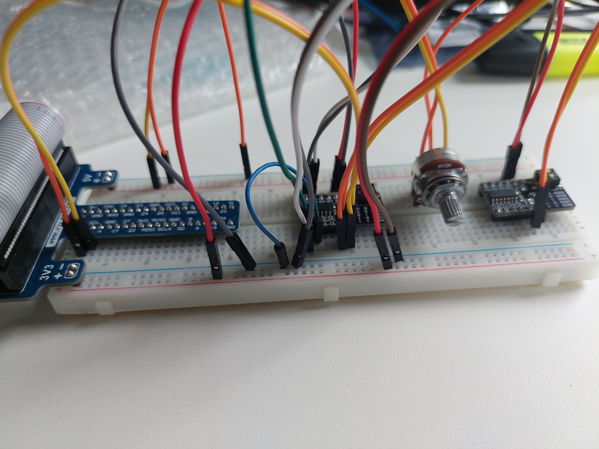
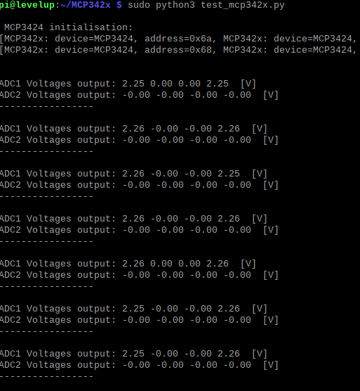

# MCP3424 ADC 18bits with PGA 

## 18-Bit, Multi-Channel Analog-to-Digital Converter with I2C Interface and On-Board Reference

The MCP3422, MCP3423 and MCP3424 devices
(MCP3422/3/4) are the low noise and high accuracy
18-Bit delta-sigma analog-to-digital converter
family members of the MCP342X series from Microchip
Technology Inc. These devices can convert analog
inputs to digital codes with up to 18 bits of resolution.

* 4 channels: MCP3424

* I2C Interface

* On-Board Voltage Reference (VREF)

* Up to 18 bits of resolution

* Input range of ± VREF ± 2.048V differentially

* PGA gain of x1, x2, x4, or x8

Python driver

## License

[DRINKOTEC](https://drinkotec.ch/)

